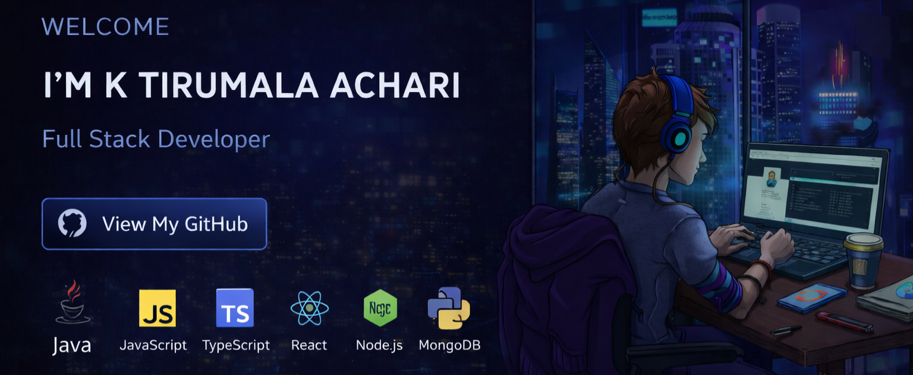
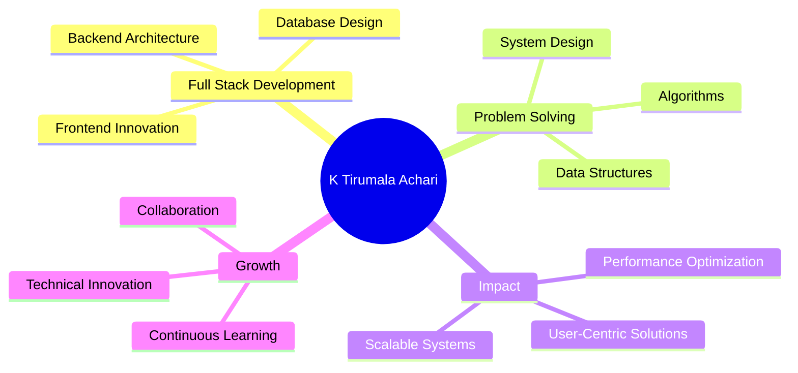

<div align="center">
 
# 👋 Hi, I'm K Tirumala Achari


[](ktirumalaachari.vercel.app)
[](https://www.linkedin.com/in/k-tirumala-achari-921106307/)
[](mailto:ktirumalaachari@gmail.com)
[](https://github.com/ktirumalaachari)

</div>


## 🚀 About Me

```typescript
const Tirumala = {
  location: "Berhampur, Odisha 📍",
  education: "B.Tech CSE @ NIST University 🎓",
  year: "Final Year (2022-2026)",
  cgpa: "7/10",
  passion: "Building user-centric technological solutions",
  currentFocus: "Full Stack Development & Problem Solving",
  availability: "Open to opportunities 🌟",
};
```

💡 **Driven by innovation** | 🎯 **Focused on impact** |🌱 **Continuous learner**

## 💻 Tech Stack

<table>
  <tr>
    <td><strong>Languages</strong></td>
    <td>
      
      
      
      
    </td>
  </tr>

  <tr>
    <td><strong>Frontend</strong></td>
    <td>
      
      
      
      
      
    </td>
  </tr>

  <tr>
    <td><strong>Backend</strong></td>
    <td>
      
      
      
    </td>
  </tr>

  <tr>
    <td><strong>Databases</strong></td>
    <td>
      
      
    </td>
  </tr>

  <tr>
    <td><strong>Tools & Platforms</strong></td>
    <td>
      
      
      
    </td>
  </tr>
</table>

## 🌟 What Drives Me

<div align="center">



</div>

## 📫 Let's Connect!


I'm always excited to collaborate on innovative projects and discuss technology!

<div align="center">

**K Tirumala Achari**  
Full Stack Developer

[](https://github.com/ktirumalaachari)
[](https://ktirumalaachari.vercel.app/)
[](ktirumalaachari@gmail.com)
[](https://www.nist.edu/)
   

<h3 align="center">🚀 Thank you for visiting my profile!</h3>

<div align="center">
  
</div>

