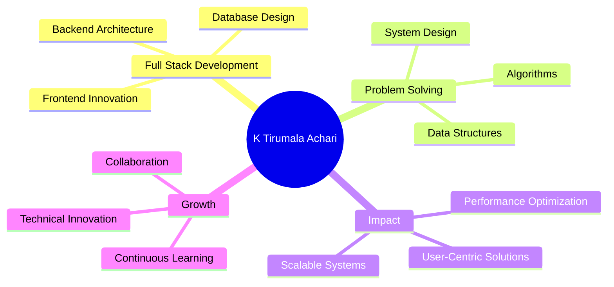

<div align="center">


</div>


<div align="center">

# 👋 Hi, I'm K Tirumala Achari


[](https://ktirumalaachari.vercel.app)
[](https://www.linkedin.com/in/k-tirumala-achari-921106307/)
[](mailto:ktirumalaachari@gmail.com)
[](https://github.com/ktirumalaachari)
<a href="https://instagram.com/k_tiru_mala_achari"></a>
<a href="https://leetcode.com/u/KTirumalaAchari/"></a>
</div>


## 🚀 About Me

```typescript
const Tirumala = {
  location: "Berhampur, Odisha 📍",
  education: "B.Tech CSE @ NIST University 🎓",
  year: "Final Year (2022-2026)",
  cgpa: "7/10",
  passion: "Building user-centric technological solutions",
  currentFocus: "Full Stack Development & Problem Solving",
  availability: "Open to opportunities 🌟",
};
```

💡 **Driven by innovation** | 🎯 **Focused on impact** |🌱 **Continuous learner**

## 💻 Tech Stack

### 🧠 Languages

<p align="center">
  
  
  
  
  
  
</p>

### 🎨 Frontend

<p align="center">
  
  
  
  
  
</p>

### ⚙️ Backend

<p align="center">
  
  
  
  
</p>

### 🗄️ Databases & Cloud

<p align="center">
  
  
  
  
  
</p>

### 🛠️ Tools & DevOps

<p align="center">
  
  
  
  
  
  
  
</p>

## 🎯 My Projects

<table>
<tr>
<td width="50%">

### 🛒 E-Commerce Platform
**Full Stack Shopping Web Application**


**Key Features:**
- 🛍️ Product browsing and search
- 🔐 JWT authentication & email OTP verification
- ❤️ Wishlist and cart management
- 📦 Order history and invoice PDF generation
- 📊 Admin dashboard with analytics and stock alerts

**Impact:** Built a complete Full Stack E-commerce Platform with secure authentication and responsive UI.

</td>
<td width="50%">

### 🔐 MERN Authentication System
**Secure User Authentication Platform**


**Key Features:**
- 🔑 Secure user registration & login
- 🔒 JWT-based authentication
- 🧂 Password encryption & hashing
- 🛡️ Protected routes and session management
- 📱 Responsive UI design

**Impact:** Implemented a reusable authentication system for modern MERN applications.

</td>
</tr>

<tr>
<td width="50%">

### 💬 Real-Time Chat Application
**Instant Messaging Platform**


**Key Features:**
- ⚡ Real-time messaging using Socket.io
- 🔐 JWT authentication
- 😀 Emoji support in chat
- 🖼️ Image sharing with Cloudinary
- 🟢 Online user status & chat history

**Impact:** Built a scalable real-time chat system with modern UI using React and Tailwind CSS.

</td>
<td width="50%">

### 💳 Credit Card Fraud Detection
**Machine Learning Fraud Detection System**


**Key Features:**
- 🤖 Machine learning fraud detection model
- 📊 Interactive dashboard using Plotly.js
- 📁 CSV transaction data processing
- 🔌 REST API integration using Flask
- 📱 Progressive Web App support

**Impact:** Detects suspicious credit card transactions in real time with an interactive analytics dashboard.

</td>
</tr>
</table>

---

### 🚀 Want to see more?

Check out my repositories for more exciting projects!

[](https://github.com/ktirumalaachari)

## 📊 GitHub Statistics

<table>
<tr>
<td width="50%" align="center">

<picture>
  <source 
    media="(prefers-color-scheme: dark)" 
    srcset="https://junaid-readme-stats.vercel.app/api/top-langs?username=ktirumalaachari&layout=compact&langs_count=7&theme=vision-friendly-dark&hide_border=true&bg_color=0D1117"
  />
  <source 
    media="(prefers-color-scheme: light)" 
    srcset="https://junaid-readme-stats.vercel.app/api/top-langs?username=ktirumalaachari&layout=compact&langs_count=7&theme=default&hide_border=true&bg_color=FFFFFF"
  />
  
</picture>

</td>

<td width="50%" align="center">

<picture>
  <source 
    media="(prefers-color-scheme: dark)" 
    srcset="https://junaid-readme-stats.vercel.app/api?username=ktirumalaachari&show_icons=true&locale=en&theme=vision-friendly-dark&hide_border=true&bg_color=0D1117"
  />
  <source 
    media="(prefers-color-scheme: light)" 
    srcset="https://junaid-readme-stats.vercel.app/api?username=ktirumalaachari&show_icons=true&locale=en&theme=default&hide_border=true&bg_color=FFFFFF"
  />
  
</picture>
<div align="center">
  
</div>

</td>
</tr>
</table>

<div align="center">
  
</div>

## 📈 Coding Profile Stats

<div align="center">
  
[](https://leetcode.com/u/KTirumalaAchari/)

</div>

## 🌟 What Drives Me

<div align="center">



</div>

## 📫 Let's Connect!

<div align="center">

I'm always excited to collaborate on innovative projects and discuss technology!

<p>
  <a href="mailto:ktirumalaachari@gmail.com">
    
  </a>
</p>

<p>
  <a href="https://ktirumalaachari.vercel.app">
    
  </a>
  <a href="https://www.linkedin.com/in/k-tirumala-achari-921106307">
    
  </a>
</p>

**📍 Location:** Berhampur, Odisha  
**📱 Phone:** +91 8455873388

</div>

<div align="center">

[](https://visitcount.itsvg.in)

</div>

<div align="center">
  
</div>

<div align="center">

### ⭐ If you like my work, don't forget to star some repositories!

**💙 Thanks for visiting my profile!**


</div>

